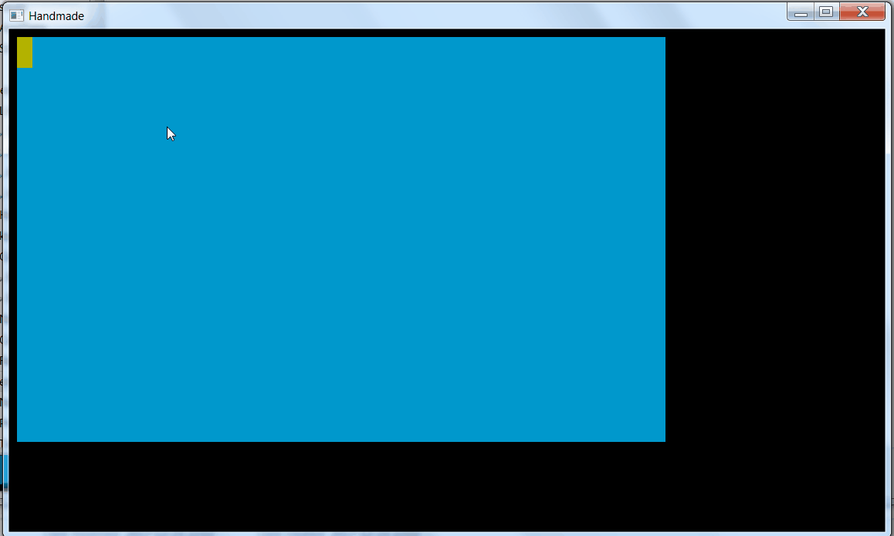

# handmade

This repository roughly contains the game code and [my other repository](https://github.com/Bjeeeern/platform) 
contains the game engine. The repository is named after the quite amazing [Handmade Hero](https://handmadehero.org/) web series
which I am working my way through as I piece by piece learn how to make this stuff. Everything is currently written by hand by me apart from a couple of functions in math.h that I will revisit once I start optimizing things.

Below is an example of the engine loading and unloading entities as the camera move around. The world is an "as large as you want" hash mapping from world coordinates to blocks of entities. When entities move about they jump from block to block.

 

I have followed along until episode 59 on and off and am now currently adding a car and some physics to figure out what I want the game to be like. I am currently using Minkowski sum to make it a bit easier to think about rotated rectangles. 

 

I did some detouring along the way to play around with 3D cameras and font file processing. I ended up with my own format that just calculates all the glyphs for monospaced fonts and dumps them as quadratic Bézier curves. More usable for editors than for user-facing rendering.

 

I also tried porting the platform to Android and OSX except for the audio parts, but it has been a while since I used the code so I will probably just have to rewrite it. 

(If you see no gifs turn off your adblock for github!)
