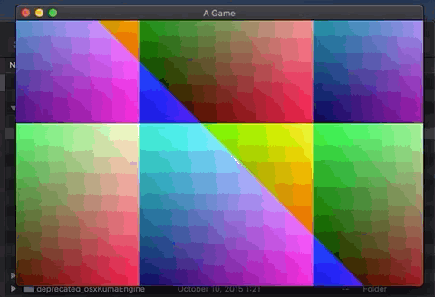
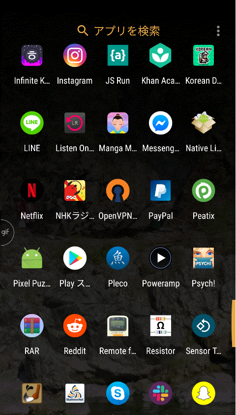
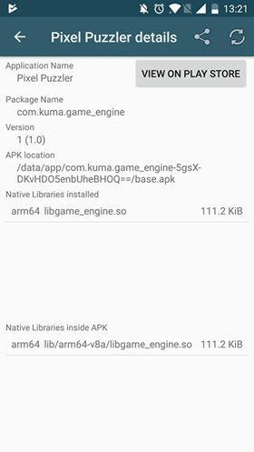

# platform

This repository roughly contains the game-engine and [my other repository](https://github.com/Bjeeeern/handmade) 
contains the game-code for the "handmade" game built on-top. The idea is that I will reuse this repository for developing other applications down-the-road. Everything in both of the repositories is written by hand by me apart from a couple of functions in math.h that I will revisit once I start optimizing things.

The design follows the way it is done in the [Handmade Hero](https://handmadehero.org/) web series. In short, the game is broken up into an executable part that is rewritten for every platform and a library file that gets loaded at runtime, containing the rest of the engine/game logic.

The windows executable is compiled from the win32_game.cpp.
Similarly the OSX gets compiled out from osx_game.mm and the Android apk natively from android_game.cpp. I have some old ports of the platform-layer that did the game-loop, memory allocation, input handling and pushing the framebuffer out to the screen. Debugging on Android and even OSX is a bit more involved though so I want to wait until I have more of a game to port before I write/rewrite new ports.

The interface between the executable and the library file is defined in platform.h. The idea is that the executable provides and tracks all the input and state of the program and that the library file is just logic that gets called on demand to further the program state.
functions like GAME_UPDATE_AND_RENDER and GAME_GET_SOUND_SAMPLES takes in input and state and returns audio and visual output that the executable then uses.

The only exception happens in intrinsic.h where all the CPU and compiler specific optimizations gets collected. The rest of the fuctionality are just an assortment of h-files, some building upon others.

Apart from having an easier time porting the game, this structure also lends itself to some nice features to help with debugging and tuning the game.

__Live code editing__:
Since the whole game lives inside a library file it can just be overwritten when compiling. When the executable sees that there exists a newer version it just swaps it out. If compile time is kept to a couple of seconds it allows for quick iteration.

__Looped replays__:
There is one upside of the game not owning its memory and input. If just the initial state and all following user input is stored, any given interval of the game can be replayed arbitrarily.

Here is an example where I set the game in a loop and then turn off the floor friction for the player.

And some footage of the old OSX and Android platform ports.

  

(If you see no gifs turn off your adblock for github!)
